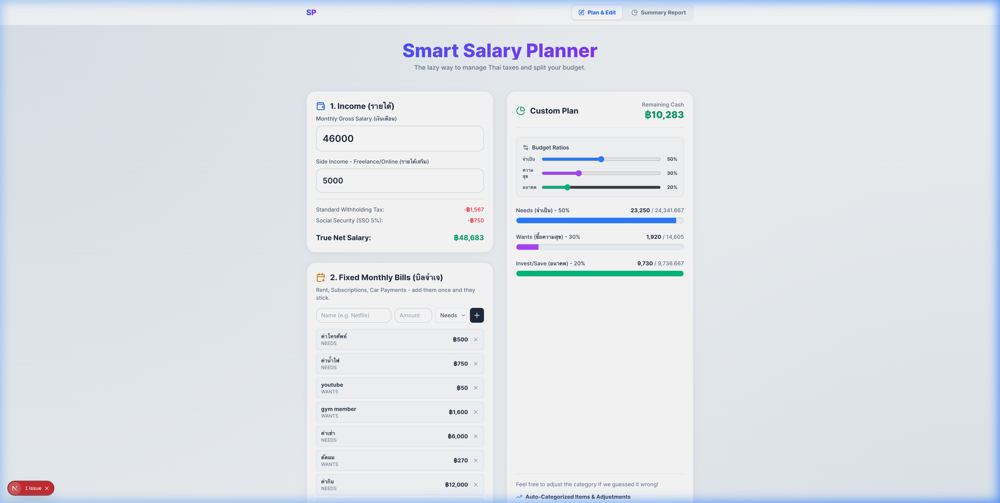
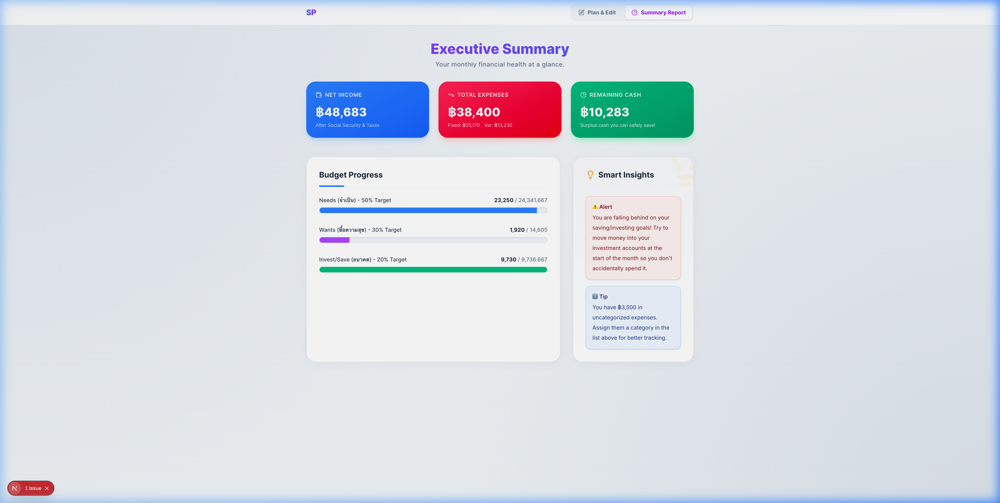

# Smart Salary Planner (Thai Context)

A modern, intelligent, and "lazy-friendly" budgeting application designed specifically for the Thai context. This application helps users effortlessly calculate their true net income (factoring in Thai taxes and Social Security) and automatically categorizes their expenses based on a simple "Dump Box" input.

## Key Features

1. **Smart Income Calculation**: Automatically deductions for Thai Social Security (SSO 5%) and standard withholding taxes to reveal your *True Net Salary*.
2. **The "Lazy" Dump Box**: Instead of filling out complex forms, you can simply type or paste your expenses in natural language (e.g. `กาแฟ 60 บาท 30 วัน`). The app uses regex matching to parse the numbers and auto-categorizes them into Needs, Wants, or Investments based on keywords.
3. **Fixed Monthly Bills Manager**: A dedicated section to add recurring expenses like Rent, Subscriptions, or Car Payments. These are saved persistently to your browser.
4. **Dynamic Checklist**: A "Don't Forget!" checklist of commonly missed expenses (e.g. Phone Bills, Pet Care). The checklist intelligently hides items you've already added and features a Randomizer dice to show fresh ideas.
5. **Flexible Budget Bars**: Set your own budget ratios (e.g. the classic 50/30/20 rule). The progress bars dynamically scale past 100% to clearly visualize overspending in red.
6. **AI Smart Insights**: Based on your inputs, the application generates personalized financial advice (e.g. warning you if your fixed costs are too high, or congratulating you on hitting investment goals).
7. **Offline Persistence**: Entirely powered by `localStorage`. Everything you type is instantly saved locally, meaning you can close the tab and return later without losing any data, no account required.
8. **Executive Summary Report**: A dedicated clean dashboard view to review your final financial health without the distraction of input boxes.

---

## Application Previews

### 1. Plan & Edit Interface
The main dashboard where users input their salary, customize their budget percentages, configure fixed bills, and use the free-form Dump Box.



### 2. Summary Report
A clean, read-only "Executive Summary" tab that visualizes the User's financial health, their progress bars, and the AI-generated smart insights.



---

## Tech Stack
- **Framework**: [Next.js](https://nextjs.org/) (App Router)
- **Language**: TypeScript
- **Styling**: Tailwind CSS v4
- **Icons**: Lucide React
- **Data Persistence**: Local Storage (Currently), Supabase (Planned)

## Getting Started

First, install the dependencies if you haven't already:
```bash
npm install
```

Then, run the development server:
```bash
npm run dev
```

Open [http://localhost:3000](http://localhost:3000) with your browser to experience the application.
